<<<<<<< HEAD
<div align="center">

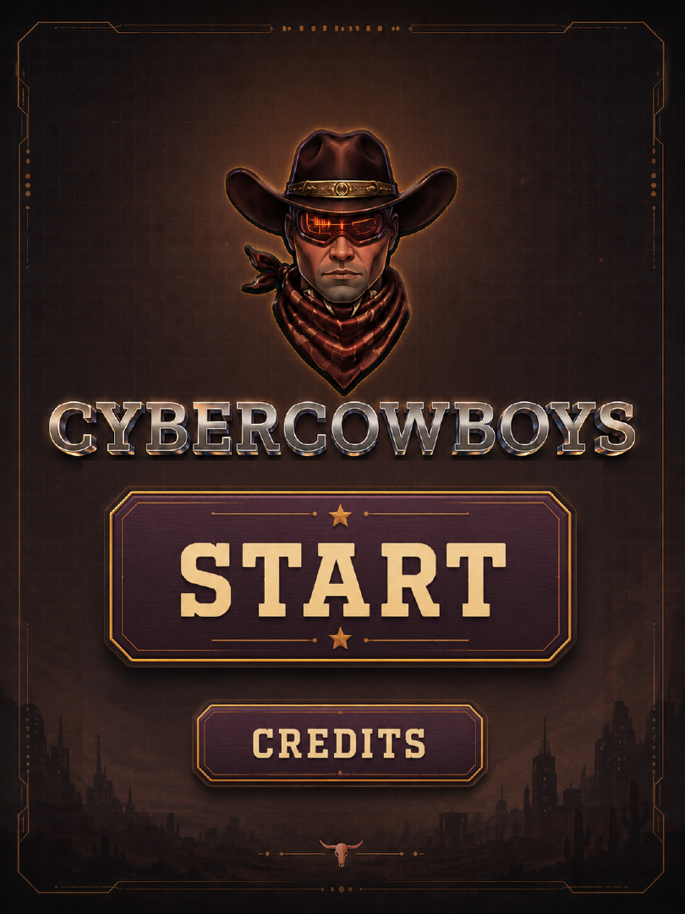

# 🤠 CyberCowboys

### An enhanced horse-riding experience for Snap Spectacles

*Visualizing English riding lessons in augmented reality — built on the idea that some lessons are better felt and seen than spoken.*

[](https://www.spectacles.com/)
[](https://ar.snap.com/lens-studio)
[](https://cybercowboys.fly.dev)
[]()

</div>

---

## 🌵 The story behind it

After volunteering in assistive **equine therapy** sessions, we noticed something. Some riders with disabilities have a hard time receiving *verbal* instructions, but respond better to verbal instructions. Snap Spectacles is the technology we use in Cybercowboys to **communicate beyond words**.

**CyberCowboys** is an augmented-reality riding experience where horse-riding lessons become something you can *see* laid out on the real arena floor in front of you. From elementary basic commands all the way up to advanced jumping courses.

---

## ✨ What it does

- 🎚️ **Lessons across four levels** — novice, elementary, intermediate, and advanced English riding lessons.
- 🏗️ **Design your own arena** — place cones, poles, barrels, jump fences, cavaletti, stop zones, number tags, and start/finish lines, then draw the path the horse should follow.
- 💾 **Save & reload** — store your arena arrangements and pull them back up to practice later.
- 🥽 **See it in AR** — the course renders as 3D obstacles and a glowing path on the real ground through Spectacles.
- 🎯 **Calibration mode** — rotate, scale, and move the virtual arena so it lines up with your *actual* riding arena.
- 🔄 **Live & real-time** — edits made on the web update inside Spectacles within about a second, over WebSocket.

> 🔮 **On the roadmap:** multi-player sessions, so instructor and rider (and friends) can share the same arena.

---

## 🎬 See it in action

| Riding through a course | Calibrating |
|:--:|:--:|
|  |  |

| Creating an arena | Picking a pre-made lesson |
|:--:|:--:|
|  |  |


---

## 🖼️ Gallery

### The arena, live through Spectacles
Pick or design an arena and the 3D assets appear behind you on the real ground — obstacles, path markers, and all.

<p align="center">
  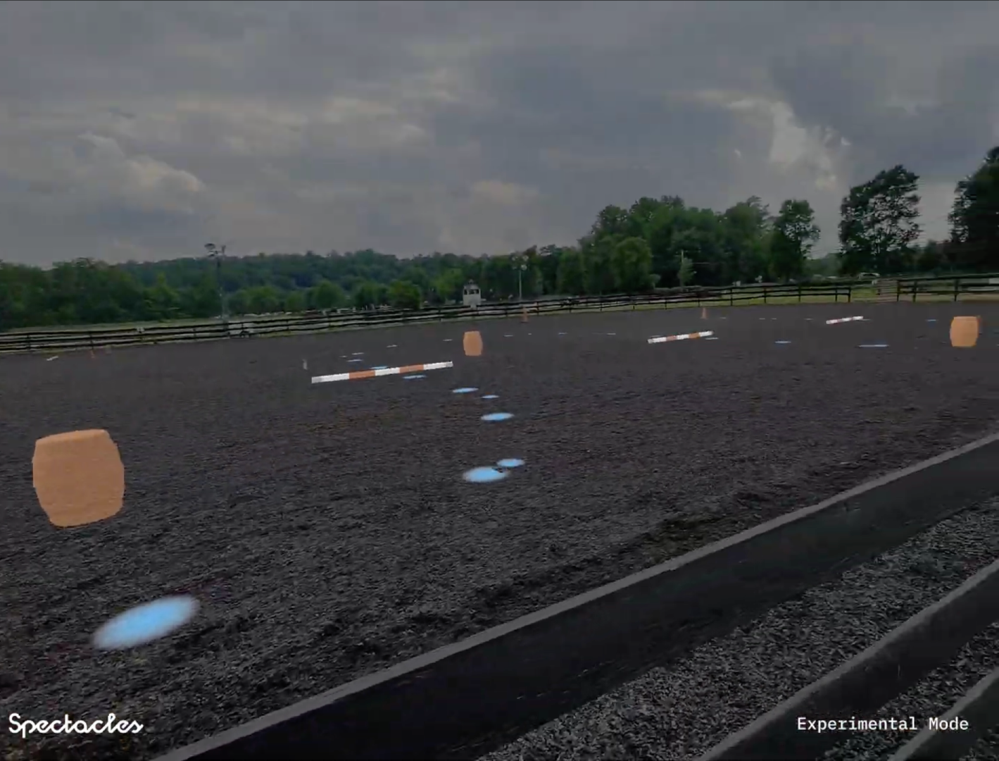
  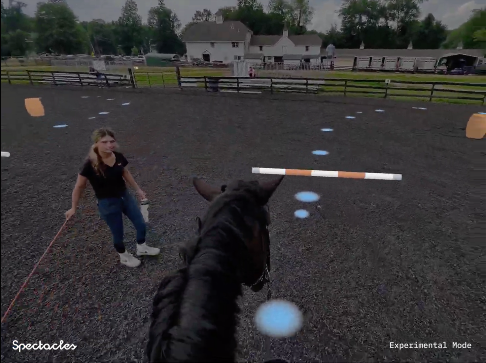
  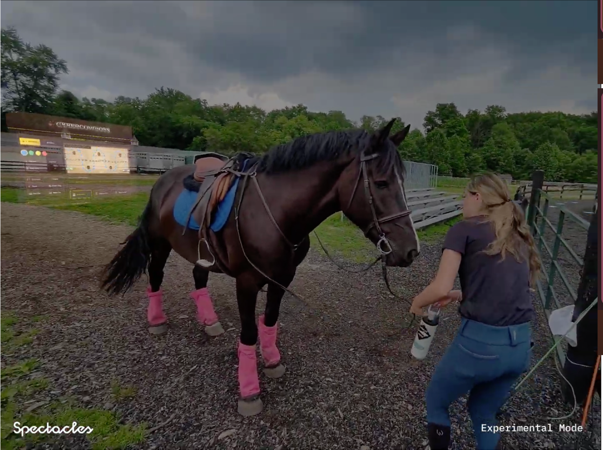
</p>

### The web designer
Build a course from scratch or load a lesson, all from the browser. Works inside the Spectacles WebView, on a phone, or on a computer.

<p align="center">
  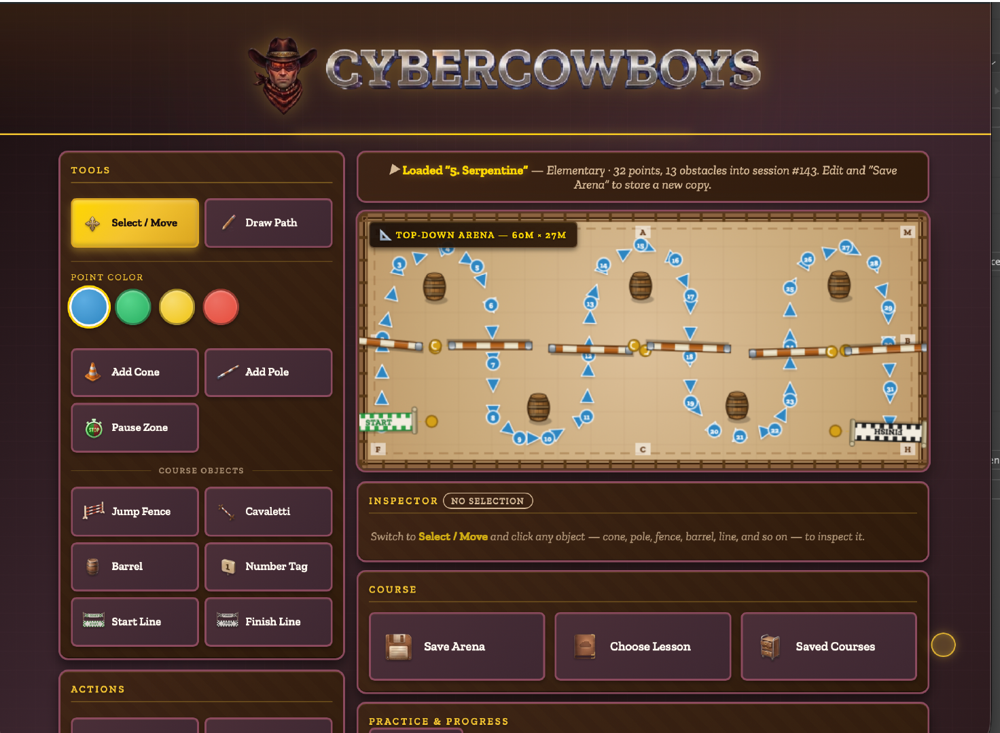
</p>

### The lesson library
Six ready-made courses spanning novice and elementary levels — from stop-walk transitions to serpentines and pole grids.

<p align="center">
  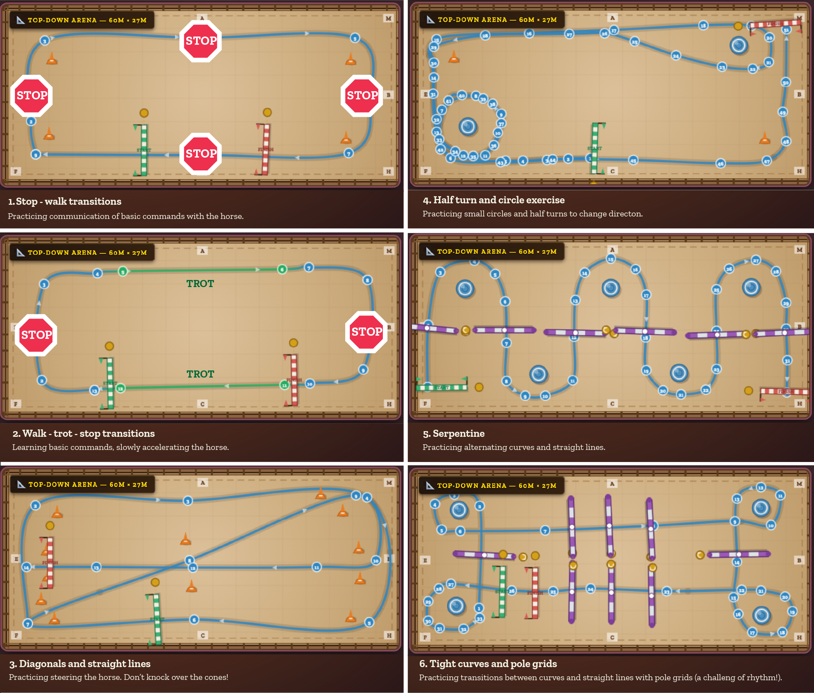
</p>

### Calibration mode
Set your arena's real dimensions and heading; the page sends calibrated coordinates straight to Lens Studio.

<p align="center">
  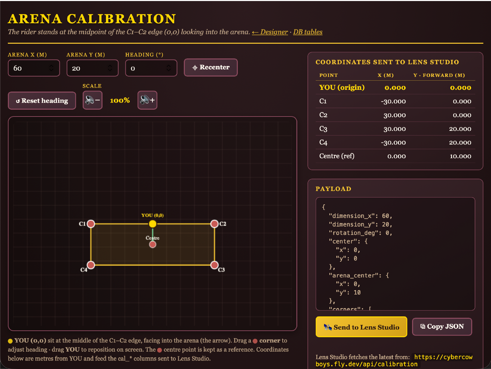
</p>

---

## 🏗️ How it's built

CyberCowboys has two halves that talk to each other in real time.

```
  ┌─────────────────────────────┐         WebSocket          ┌──────────────────────────────┐
  │   cybercowboys.fly.dev      │  ──── live DB snapshots ──▶ │   Spectacles Lens (this repo) │
  │                             │                            │                              │
  │  • HTML / CSS / vanilla JS  │  ◀── arena edits, cal ───   │  • WebView (shows the site)  │
  │  • Node.js + WebSocket      │                            │  • ArenaStreamer (3D arena)  │
  │  • SQLite (11 tables)       │                            │  • FloorPlacer / Surface     │
  │                             │                            │    Detection (ground plane)  │
  │  Designer · Lessons ·       │                            │  • StartMenu (front screen)  │
  │  Calibration · DB viewer    │                            │  • SIK + UIKit interactions  │
  └─────────────────────────────┘                            └──────────────────────────────┘
```

### The web app
A website made with **HTML, CSS, and vanilla JavaScript**, a **Node.js** backend, and **SQLite** for storage, hosted on **Fly.io** at [cybercowboys.fly.dev](https://cybercowboys.fly.dev). Real-time communication runs over a **WebSocket** so any change to the database is pushed straight out to connected clients.

The database holds everything about a session — obstacles, the drawn path, arena dimensions, calibration, and the saved-course library:

<p align="center">
  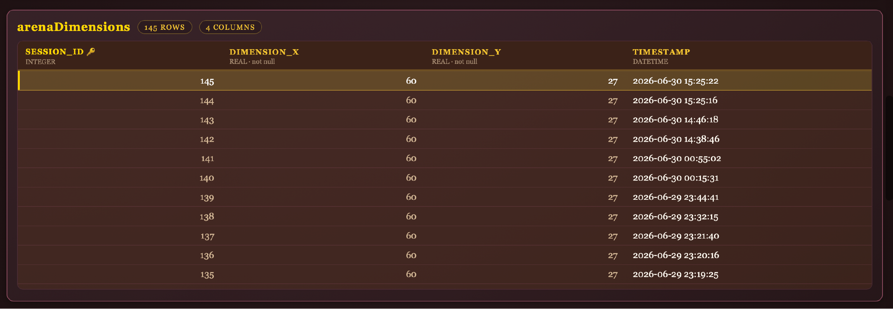
  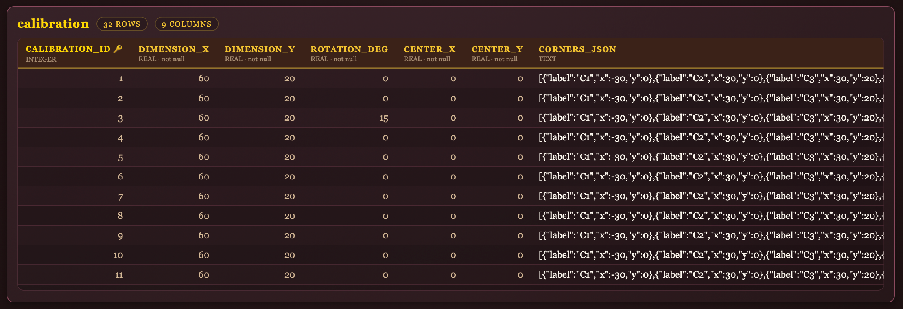
</p>
<p align="center">
  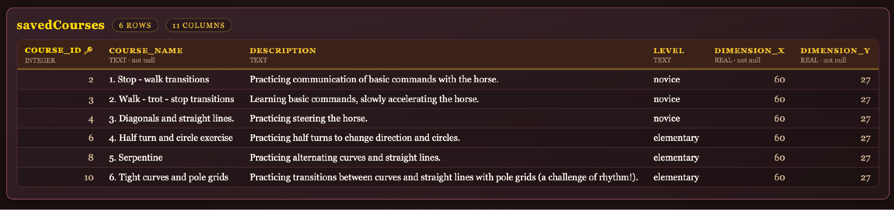
  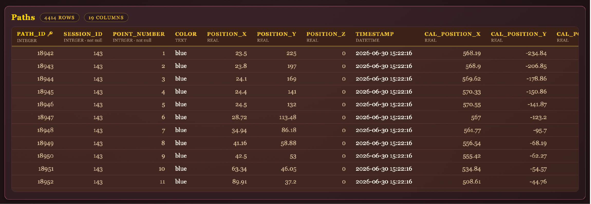
</p>

### The Spectacles Lens
A Lens Studio project that renders the arena in AR. Its TypeScript components:

| Script | What it does |
|---|---|
| `ArenaStreamer.ts` | Connects to the Fly.io WebSocket, subscribes to the live DB, and lays every obstacle + path point on the floor under `arenaRoot`. Rebuilds in real time on each snapshot and plays a proximity sound when the wearer reaches an obstacle. |
| `ArenaStreamerTyped.ts` | Typed variant of the streamer used with the refresh button. |
| `FloorPlacer.ts` | Keeps the arena pinned to the **real floor** (instant assumed-floor, then look-to-confirm on device). Pinch the ground to recenter. |
| `SurfaceDetection.ts` / `CircleAnimation.ts` | Path-Pioneer-style ground-plane detection with the look-and-hold ring. |
| `StartMenu.ts` | The front screen — Start / Credits / Home — and shows, hides, and reloads the WebView. |
| `WebViewReload.ts` | Reloads the embedded website when its button is pinched. |
| `RefreshButtonTyped.ts` | Forces a fresh pull of all DB snapshots from a pinch button. |

**Coordinate mapping:** the rider stands at the midpoint of the arena's top edge `(0,0)` looking in; `+x` is right and `+y` is forward into the arena. The Lens mirrors the server's pixel→metre transform exactly, so the AR layout matches the web designer one-to-one. (World units in Lens Studio are centimetres — 1 m = 100 units.)

### Using it with Spectacles
When you wear the Spectacles, the **WebView floats in front of you** and the **arena builds behind you**. Pick or design an arena on the WebView, then turn around to see the 3D course on the real ground. Switch to **calibration mode** to rotate, scale, and slide the virtual arena until it sits exactly on your real one.

---

## 📦 Tech stack

| Layer | Technology |
|---|---|
| AR runtime | Snap **Spectacles** · **Lens Studio 5.15.4** (Experimental API) |
| Lens packages | Spectacles Interaction Kit · Spectacles UIKit · WebView |
| Lens scripting | TypeScript |
| Web frontend | HTML · CSS · vanilla JavaScript |
| Web backend | Node.js · WebSocket |
| Database | SQLite |
| Hosting | Fly.io — [cybercowboys.fly.dev](https://cybercowboys.fly.dev) |

---

## 🚀 Getting started

### Try the web app
Just open **[cybercowboys.fly.dev](https://cybercowboys.fly.dev)** in any browser — on a computer, a phone, or inside the Spectacles WebView. Pick a lesson or design your own arena.

- 🎨 **Designer** — build and edit a course
- 📚 **Choose Lesson** — load one of the pre-made lessons
- 🎯 **Calibration** — set your arena dimensions and heading
- 🗄️ **DB tables** — inspect the live database

### Run the Lens
1. Install **Lens Studio 5.15+**.
2. Open this project (`Spectacles-Cybercowboys *.esproj`).
3. Make sure the **Experimental API** flag is enabled (this Lens uses it for ground classification).
4. The `ArenaStreamer` component's `websocketUrl` should point at `wss://cybercowboys.fly.dev/`.
5. Push to your Spectacles, press **Start**, and turn around to see the arena.

> Tip: the streamer's `arenaScale` input shrinks the whole 60 m × 20 m arena to fit a room or tabletop for testing (e.g. `0.1`).

---

## 📁 Repository structure

```
.
├── Assets/
│   ├── ArenaStreamer.ts          # live arena ← WebSocket
│   ├── ArenaStreamerTyped.ts
│   ├── FloorPlacer.ts            # pin arena to the real floor
│   ├── StartMenu.ts              # front screen + WebView control
│   ├── WebViewReload.ts
│   ├── RefreshButtonTyped.ts
│   ├── SurfaceDetection/         # ground-plane detection
│   └── ...                       # prefabs, materials, 3D models, textures
├── Packages/                     # SIK · UIKit · WebView
└── docs/
    ├── images/                   # screenshots used in this README
    └── gifs/                     # riding / calibrating / creating / picking
```

---

## 👥 Credits

Made with grit and good intentions by the **CyberCowboys** team — born out of volunteering in assistive equine therapy, and a belief that we can communicate beyond words.

🐴 *Yeehaw.*
=======
# CYBERCOWBOYS
>>>>>>> 6913b1832701b2f5410fedd95e458d7bc4ee074d
